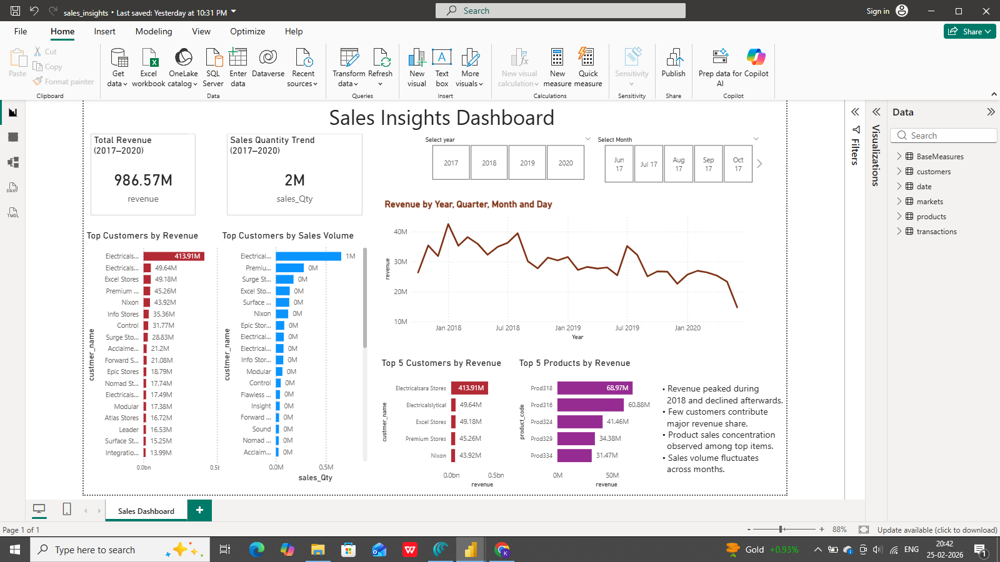

📊 Sales Insights Dashboard - Power BI Project

🔍 Project Overview
This project analyzes company sales performance using SQL and Power BI to identify revenue trends, customer contribution, and product performance.

🎯 Business Problem
Businesses need clear visibility into sales performance to make data-driven decisions and improve revenue growth.

🛠 Tools & Technologies
- Microsoft Power BI
- SQL
- Data Cleaning
- Data Visualization
- Business Analysis

📈 Key Insights
- Revenue trends analyzed across multiple years
- Top customers contributing majority revenue identified
- Product-wise sales performance evaluated
- Sales quantity trends monitored over time

📷 Dashboard Preview

 🚀 Project Outcome: 
Built an interactive dashboard enabling stakeholders to monitor KPIs and make informed business decisions.

Author:Shravani Kola
